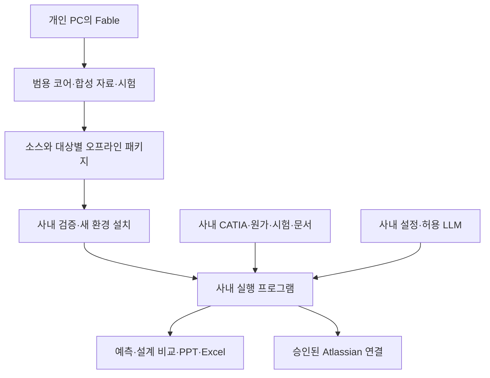

# 설계·문서 업무 자동화 범용 코어 — 개인 개발·사내 반입 설계 v4

대상: 개인 PC의 Claude Code Fable로 범용 코어를 개발하고, 승인된 방법으로 사내 PC에 복사하여 설치·통합하는 프로젝트.
이 문서는 이전 v1/v2/v3를 통합·대체한다. 개인 PC의 개발용 Fable과 완성 프로그램의 사내 실행용 LLM을 명확히 구분한다.

## 1. 결정 사항

소개 명칭은 **“설계·문서 업무 자동화 프로그램”**을 권장한다. 범용 코어는 실제 실행되는 소프트웨어이며, 그 안에 예측 모델·문서 도구·선택적 AI 에이전트 기능을 넣는다. Claude Code skill은 개발이나 반복 지시를 돕는 보조 수단으로 구분한다.

| 구분 | 담당 역할 | 성능을 확인할 방법 |
|---|---|---|
| 개인 Fable | 코드를 구현·수정·검증하는 개발 도구 | 코드 시험·반입 설치 시험 |
| 범용 코어 | 계산·파일 처리·학습·작업 이력 관리 | 알려진 정답과 기능별 인수시험 |
| 사내 허용 LLM | 자연어 해석·요약·허용 도구 호출 계획 | 사내 실제 업무 예제 평가 |
| 업무 예측 모델 | 회사 데이터로 원가·성능 등을 추정 | 학습에 쓰지 않은 설계/시험 데이터 오차 |

개발용 모델의 이름만으로 완성 프로그램이나 업무 예측의 품질을 판단하지 않는다. 사내 LLM을 바꿔도 검증된 계산식·학습 코드·문서 검증 규칙은 동일한 코어에서 실행한다.

**개인 PC에서는 소스·시험·합성 데이터·오프라인 설치 패키지를 제작하고, 사내 PC에서는 새 실행환경을 구성한 뒤 회사 설정과 실제 자료를 연결한다.**

| 개인 PC의 Fable이 완료할 일 | 사내에서 완료할 일 |
|---|---|
| 모듈 구현·단위시험·통합시험 | 실제 OS/Python/보안 정책 적합성 확인 |
| 가상 CAD snapshot과 합성 시험 데이터 | 실제 CATIA·PDM 데이터 추출·매핑 |
| 가상 원가표·PPTX/XLSX 예제와 템플릿 | 회사 원가 기준·문서 양식·실제 데이터 연결 |
| 오프라인 CPU 학습·문서 생성 | 실데이터 모델 학습·업무 오차 검증 |
| LLM·Atlassian mock/프로토콜 adapter | 정확한 사내 API·model ID·인증·권한 설정 |
| 대상별 wheelhouse·설치기·복구/업데이트 | 반입 파일 검증·설치·사내 연동 시험 |

Fable은 **개발 도구**다. 사내 프로그램에 Fable 설치·개인 구독·개인 API 키가 필요한 구조로 만들지 않는다. 프로그램은 offline 모드에서도 핵심 기능을 수행하고, 필요할 때 회사가 허용한 LLM만 연결한다.

사용자는 사진에 있는 모델만 사내에서 허용된다고 명확히 설명했다. 이 설명을 전제로 하되, 사진의 표시 이름을 API ID로 자동 변환하지 않는다. 모델 간 성능 순위를 전제로 역할을 고정하지 않고 실제 사내 연결 시험으로 선택한다.

## 2. 구성과 데이터 경계

개인→사내 전달에는 코드·공개 의존성·합성 fixture·매뉴얼만 포함한다. 회사 원본·사내 URL·계정·키·사내 모델 가중치·문서 색인은 개인 개발 패키지에 포함하지 않는다.

사내에서 발생한 문제를 개인 Fable에게 전달할 필요가 있으면 사내 담당자가 합성 입력으로 재현한 최소 사례를 작성한다. 진단 내보내기는 허용 필드만 사용하는 로컬 미리보기이며 자동 전송하지 않는다. 정규식 마스킹만으로 안전한 반출을 보장한다고 표현하지 않는다.

## 3. 배포 방식: 폴더 복사와 실제 설치를 구분

기본 방식은 **소스 + 앱 wheel + 모든 필요한 dependency wheel + 고정 버전/해시 + 오프라인 설치기**다. 여기서 wheelhouse는 인터넷 없이 설치할 수 있도록 모은 Python 패키지 파일 폴더다.

| 방식 | 채택 기준 |
|---|---|
| 개인 `.venv` 그대로 복사 | 기본 방식에서 제외. 경로·기반 Python·플랫폼에 의존 |
| 대상별 wheelhouse + 사내 승인 Python | **기본 권장**. 사내에서 새 가상환경 생성 |
| 승인된 Python 런타임 동봉 | 사내 Python이 없는 경우의 선택지. 재배포·설치 허용 여부와 실제 동작 확인 필요 |
| PyInstaller 실행파일 | 필요할 때 별도 배포 프로파일로 검증. 모든 환경에 통하는 EXE라고 가정하지 않음 |
| Docker/WSL/공개 GitHub 의존 | 사내 필수 조건으로 두지 않음 |

Python 공식 문서는 가상환경을 옮겨 쓰는 대상으로 보지 않고 대상 위치에서 재생성하도록 설명한다. PyInstaller 산출물도 빌드 OS·Python·아키텍처에 영향을 받는다. [Python venv](https://docs.python.org/3/library/venv.html), [PyInstaller](https://pyinstaller.org/en/stable/operating-mode.html)

EXE 포장이 기업의 실행 차단이나 외부 소프트웨어 반입 정책을 해결하지는 않는다. 실제로 허용된 방식 안에서 설치한다.

## 4. 대상 환경 확인과 호환성 계약

사내 PC의 정확한 사양은 아직 제공되지 않았다. **Windows x64 / CPython 3.12 / CPU**를 초기 참조 프로파일 예시로 사용하되, `target_confirmed=false`로 기록하고 실제 사내 환경으로 확정한다. 사내 승인 Python이 다른 버전이면 그 버전에 맞는 새 lock/wheelhouse를 만든다. Python 3.12 지원은 선택한 모든 의존성에서 확인해야 한다.

`target_profile.json` 필수 필드:

- OS 종류·버전, CPU 아키텍처, Python implementation·major/minor·ABI
- 선택 기능 집합(core/documents/ml/cad), CPU/GPU 모드
- CATIA/Office 존재 여부·버전 등 로컬 선택 정보
- GPU 프로파일이면 GPU·드라이버·선택한 PyTorch 빌드의 호환성
- target_confirmed, 확인 일시, 검증한 환경 정보

`preflight.py`는 표준 라이브러리만으로 실행하고, Python이 없는 경우 `preflight.ps1`이 그 사실과 설치 조건을 진단한다. 로컬 상세 보고서와 최소 환경 요약을 분리한다. 최소 요약에는 사용자명·호스트명·사내 주소·토큰·파일 목록을 넣지 않는다. 요약 반출은 회사 절차를 따른다.

타깃 OS/architecture/Python이 개인 PC와 다르면 호스트의 `pip freeze`를 사내 lock으로 쓰지 않는다. 대상별 버전·wheel tag·환경 marker·전이 의존성을 검증한다. cross-download는 파일 확보이며 해당 OS에서의 설치/실행 검증을 대신하지 않는다. [pip download](https://pip.pypa.io/en/stable/cli/pip_download/)

CPU를 초기 운영 기본값으로 삼고 GPU는 별도 프로파일로 만든다. CPU/GPU torch wheel을 같은 환경에 무조건 덮어쓰지 않는다. CATIA·Office·GPU가 없는 개인 PC에서도 범용 코어 구현과 합성 시험을 완료한다.

## 5. 개인 개발 프로파일과 사내 운영 프로파일

| 프로파일 | 연결·데이터 정책 |
|---|---|
| `personal-dev` | 합성 데이터. 지정한 공식 배포처에서 개발 의존성 확보 가능. 개발 도구 Fable의 연결은 별도 |
| `transfer-test` | 반입 ZIP만 사용. 새로운 설치 경로·깨끗한 환경에서 캐시/인터넷 없이 설치·시험 |
| `corp-offline` | 사내 로컬 파일 처리, API 호출 0회. 기본 운영 프로파일 |
| `corp-gateway` | 명시적 사내 API origin·인증·model ID가 있을 때만 연결 |

offline 문서 작성은 구조화된 입력·로컬 검색 결과·템플릿으로 수행한다. 자유로운 자연어 요청 해석·요약·문안 생성은 승인된 사내 LLM을 연결하고 해당 기능을 검증한 경우에 제공한다. 기본 코어만으로 모든 대화형 AI 기능이 제공된다고 표현하지 않는다.

개인 개발에서 허용된 다운로드 주소를 사내 운영 설정에 상속하지 않는다. 사내 설치기에는 public PyPI/GitHub/Hugging Face fallback, 자동 업데이트, 설치 중 `pip install -e .`나 인터넷 source build를 넣지 않는다. 개인 환경의 `.env`, Claude 인증, 프록시, 패키지 cache를 통째로 복사하지 않는다.

## 6. 범용 코어와 현장 연결의 모듈 경계

프로젝트와 Python package 이름은 기존 호환성을 위해 `corp-dl-agent`, `corp_dl_agent`를 유지한다.

| 모듈 | 개인 PC에서 검증할 범위 | 사내 연동 |
|---|---|---|
| core/config/state | 설정·job·상태·예산·중단/재개 | 경로·자원 설정 |
| engineering | 단위·중량·원가·설계 비교 | 실제 재료·원가 기준 |
| ml | CSV 회귀/이진 분류·모델 저장/예측 | 실제 해석/시험 데이터 |
| documents | PPTX/XLSX 색인·근거표·템플릿 생성 | 회사 자료·양식 |
| adapters/cad | snapshot import·검증, 지원 버전 adapter의 계약 시험 | 설치된 CATIA에서 live 시험 |
| adapters/llm | offline planner·OpenAI/Anthropic 형식 모의 HTTP | 실제 사내 gateway |
| adapters/atlassian | dry-run·mock·출처/권한 계약 | Bitbucket/Jira/Confluence/Bamboo |
| packaging/installer | 압축·해시·새 환경 설치·업데이트 | 실제 반입·인수시험 |

AI가 선택할 수 있는 동작은 `validate_input`, `calculate_mass_cost`, `train_model`, `predict`, `search_documents`, `generate_report` 등 등록된 도구로 제한한다. 각 도구의 입력 schema·접근 경로·출력·실패 상태를 코어가 검증한다. LLM이 생성한 Python/셸을 런타임에서 바로 실행하지 않는다. 파일에 적힌 지침이나 AST 검사만으로 실행 격리가 보장된다고 표현하지 않는다.

업무별 mapping은 회사 설정이나 검증된 extension 모듈로 둔다. CATIA field mapping, 보고서 placeholder, 원가 계수, 사내 API 규격 때문에 학습 코어를 통째로 수정하지 않게 한다. 필수 경로에 빈 `pass`/가짜 성공을 넣지 않는다. 미확정 API는 사용 불가 상태와 계약을 명시한다.

## 7. 폴더와 설정: 업데이트해도 사내 자료를 보존

| 경로/영역 | 내용 | 업데이트 정책 |
|---|---|---|
| `releases/<release_id>/<profile_id>/` | 불변 앱·의존성·해당 버전 가상환경 | 새 위치에 추가 설치 |
| `active.json` | 활성 release/profile | 시험 통과 후 원자적 변경 |
| `company/config/` | 회사 설정·gateway·mapping | 보존, schema migration은 별도 |
| `company/templates/` | 회사 PPTX/XLSX 양식 | 덮어쓰기 금지 |
| `company/extensions/` | 사내 전용 검증된 연결 코드 | 버전·호환성 검사 후 명시 로드 |
| `workspace/data/` | 데이터 사본/로컬 입력 또는 경로 참조 | 원본 보존 |
| `workspace/runs/`, `models/`, `outputs/` | 학습 이력·모델·보고서 | 설치와 분리 |
| `workspace/state/`, `indexes/` | 로컬 DB·문서 색인 | 백업·schema 검사 |
| `backups/` | 업데이트 전 상태·설정 snapshot | 보존 기간 명시 |

경로는 설치 root와 별도 data root를 받을 수 있게 한다. 한글·공백 경로를 지원하며 사용자명·드라이브 문자를 하드코딩하지 않는다. SQLite는 로컬 디스크에 둔다. 네트워크 공유 자료는 허용 경로로 읽되 공유 경로의 SQLite를 기본값으로 사용하지 않는다.

설정 우선순위는 `package defaults < company config < 명시적 CLI 인자`다. secret은 OS 비밀 저장소 또는 지정 환경 변수 참조로 해결하며 출력된 resolved config에서는 마스킹한다. 엄격한 schema로 알 수 없는 키와 범위 오류를 거부한다.

## 8. 업무 기능: CAD·중량·원가·성능

### CATIA 데이터

`document_id, revision, configuration_id, occurrence_path, reference_id, quantity, material_id, density_kg_m3, volume_m3, mass_kg, parameters, units, geometry_status, source_hash`를 snapshot으로 저장한다.

V5 Windows Automation과 3DEXPERIENCE 연결은 서로 다른 adapter다. 개인 PC에서는 합성 snapshot과 mock으로 테스트하고 실제 메서드·라이선스·버전은 현장에서 확인한다. CSV/JSON 수입은 실제로 구현한다. 원본 수정·PLM checkout/checkin은 기본 수행하지 않는다. CATIA의 자동화 기능과 역할은 설치 제품에 따라 확인한다. [CATIA 자동화](https://www.3ds.com/products/catia/engineering/automated-engineering)

조립체의 instance·reference·수량·suppression을 구분하고 상위 총량과 하위 부품을 이중 합산하지 않는다. 밀도 미지정·기본 밀도·surface·unloaded geometry를 정상 확정값으로 출력하지 않는다.

### 중량·원가

중량은 유효 솔리드의 `kg = m³ × kg/m³` 직접 계산이 기본이다. mm³와 g/cm³ 입력은 kg 변환계수 `10^-6`을 사용한다. 표피·폼·접착제·구매품 등 미모델링 항목은 포함 범위를 표시해 더한다.

원가는 공정별 recipe로 구성하며 모든 부품을 사출품으로 가정하지 않는다. 사출품 예시는 재료+사출+후가공/조립+구매품+금형상각+명시한 기타 항목으로 나눈다. 사출가공비 예시는 `설비율(원/시간)×cycle(초/shot)/(3600×cavity×양품률)`이다. 재료 수율·runner/regrind·setup의 중복 반영을 방지한다. 단가·통화·기준일·생산량·견적/제조원가 구분을 남긴다. 미입력 값을 LLM이 생성하지 않는다.

### 성능 예측

첫 코어는 CSV 회귀와 이진 분류다. 클립 삽입력/유지력 또는 지정 하중의 도어트림 변위 등을 한 target씩 다룬다. 형상·물성과 하중·구속·접촉·마찰·온도·속도 조건을 함께 연결한다. 설계 revision·시험과 CAE 출처를 구분한다. 임의 CAE 바이너리 파싱·GNN·BSR 신경망은 초기 완료 요건에서 제외한다.

설계안 비교 결과는 직접 계산값/예측값/과거 참고값/미확인값을 구분하며 같은 조건·기준일로 비교한다. Pareto 탐색은 후속 선택 기능이고 실제 설계 변경은 원본에 자동 적용하지 않는다.

## 9. 학습·검증·복구 계약

- ID·타깃·단위·feature·group을 명시한다. 같은 시편/설계 계열의 누수를 막고 고정 분할 manifest를 저장한다. 약 70/15/15는 초기 그룹 비율 예시이며 실제 개수를 보고한다. 불가능한 그룹 분할은 실패로 처리한다.
- 전처리는 train에서만 fit한다. 미래 예측에 없는 사후 측정값과 target 파생값을 feature로 쓰지 않는다. test는 후보 확정 전 잠근다.
- 회귀는 Dummy/Ridge/HistGradientBoosting과 MLP, 이진 분류는 Dummy/LogisticRegression/HistGradientBoosting과 MLP를 비교한다. 희소/밀집 변환은 모델별 호환성과 메모리 한도를 검사한다.
- 회귀 MAE/RMSE/R²/P95는 원단위로, 분류는 정의한 average precision·ROC-AUC·recall·F1·혼동행렬로 평가한다. 분류 임계값은 validation에서 고정한다.
- CPU FP32를 기본으로 하고 CUDA/AMP는 지원 확인 후 선택한다. `model.eval()`·`inference_mode`, 유한 loss/gradient, shape/dtype를 검사한다. 로그/예측 저장의 그래프 참조·무제한 메모리를 방지한다.
- demo는 과제별 최대 2개 MLP 후보·10 epochs·300초, pilot은 6개·100 epochs·3600초를 초기 상한으로 둔다. 기준 모델·재시도도 시간 상한에 포함한다. 성능/완료 시간 보증이 아니다.
- 상태는 CREATED/VALIDATING/PLANNED/RUNNING/EVALUATING/COMPLETED 및 PAUSED/CANCELLED/FAILED/BLOCKED/BUDGET_EXCEEDED를 구분한다. trial과 attempt, lease와 heartbeat를 기록한다.
- 완료 epoch에 model·optimizer·scheduler·scaler·RNG·DataLoader generator·next_epoch를 확정한다. 강제 종료면 진행 중 epoch 일부는 다시 계산할 수 있다. 코드/data/lock 해시가 바뀌면 자동 재개하지 않는다.
- 완료 fingerprint와 산출물이 검증된 실험은 건너뛴다. 동일 워커 중복 실행을 막고 자신의 자식 프로세스만 정리한다. OOM은 새 attempt로 batch 조정 최대 2회, 의미 변경을 기록한다.
- 커스텀 autograd를 실제 구현할 때만 float64 gradcheck를 사용한다. 모델 정확도·전역적 동치성 보증으로 표현하지 않는다. [gradcheck](https://docs.pytorch.org/docs/stable/generated/torch.autograd.gradcheck.gradcheck.html)
- export는 가중치·전처리·입력 schema·단위·임계값·범위·hash를 포함한다. 새 프로세스 재로드와 예측 일치를 시험한다. 외부 임의 pickle을 입력으로 받지 않는다.

합성 예측 모델은 demo 전용 metadata를 가진다. 사내 운영에서는 합성 모델을 실제 품질 판단에 자동 선택하지 않는다. 업무 허용 오차가 없으면 `NEEDS_ACCEPTANCE_CRITERIA`다.

## 10. PPT·Excel 재활용과 생성

개인 PC에서 가상 과거 검토서·가상 원가표·PPTX/XLSX 템플릿을 직접 생성하고 테스트한다. 회사 양식으로 위장하지 않으며 합성 표시를 남긴다.

`docs index/search/generate`는 지정한 허용 폴더의 PPTX/XLSX만 기본 지원한다. PPT는 slide/shape/table/notes, Excel은 sheet/table/named range/cell 위치를 보존한다. 수식·cached value·단위·기준일·revision을 구분한다. 구형 .ppt/.xls와 이미지 OCR은 별도 지원 상태로 표시한다.

자료는 ‘양식 참고’와 ‘현재 사실 근거’를 구분한다. 승인·유효 상태와 ACL을 적용하며, 삭제·권한 철회 시 색인/캐시를 갱신한다. 첫 검색은 로컬 키워드/메타데이터 방식으로 충분하다. embedding 모델/서비스가 없어도 동작한다.

PPT와 XLSX는 동일 `report_payload.json`의 검증된 숫자를 사용한다. 각 값에 type(source/calculated/predicted/missing), unit, source locator 또는 calculation/model run ID를 붙인다. 과거 차종·날짜·단가·결론을 신규 사실로 남기지 않는다. MISSING/CONFLICT는 명시한다.

템플릿은 복사본의 명명된 placeholder/range만 편집한다. 원본·master·구조·서식을 보존하며 unsupported 요소를 조용히 삭제하지 않는다. PPTX 생성과 편집은 라이브러리 지원 범위에서 실제 보존 시험을 거친다. [python-pptx](https://python-pptx.readthedocs.io/en/latest/)

`openpyxl`은 수식을 평가하지 않는다. 핵심 수치를 Python에서 검증해 입력하는 방법과 Excel 계산 엔진으로 재계산하는 방법을 구분한다. cached value를 최신 계산으로 간주하지 않는다. 렌더러/계산 엔진이 없으면 RENDER_NOT_RUN/RECALC_NOT_RUN으로 표시한다. [openpyxl](https://openpyxl.readthedocs.io/en/stable/simple_formulae.html)

Office COM을 무인 서비스에서 기본 서버 엔진으로 운영하는 방식은 전제하지 않는다. 승인된 문서 엔진 또는 사용자 대화형 Office 확인 경로를 둔다. [Microsoft 안내](https://support.microsoft.com/en-us/visio/considerations-for-server-side-automation-of-office)

## 11. 사내 LLM·Atlassian 연결

개인 Fable의 자격증명을 앱에 상속하지 않는다. 설정값이 없는 앱 실행은 기본 offline이며 네트워크 호출이 없다. gateway를 명시했는데 URL/model ID/secret/CA가 없으면 BLOCKED_CONFIG로 보고한다.

OpenAI Chat Completions와 Anthropic Messages 형식을 별도 adapter로 시험한다. Gemini는 회사가 실제 제공하는 호환 형식에 맞춘다. endpoint·경로·인증 헤더·tool/JSON 지원을 추측하지 않는다. 실험 계획기는 허용 JSON만 제안하고 임의 Python/셸을 실행하지 않는다.

사내 origin allowlist·TLS·timeout·redirect 금지·호출/토큰 예산을 적용한다. 401/403은 중단, 429/일시 5xx는 최대 2회, JSON 교정은 1회다. 재시도도 예산에 포함한다. 문서 LLM 입력은 권한과 정책이 확인된 최소 발췌만 사용한다.

GitHub 없이도 Python 코드는 그대로 운영한다. Bitbucket=코드/PR, Jira=요청/실험, Confluence=자료/모델 카드, Bamboo 또는 승인 실행기=시험/job 제출 역할이다. 실제 설치 제품·Cloud/Data Center·API 버전을 확인한다. 코어와 connector를 분리하며 사내 원격 write는 기본 off, preview만 제공한다.

CATIA/Office 작업은 해당 설치·라이선스가 있는 환경에서, 학습은 할당된 CPU/GPU에서 수행한다. Jira나 Bamboo가 이를 자동 제공한다고 가정하지 않는다. 사내 코드는 내부 Bitbucket에서 관리할 수 있지만 개인 PC와의 자동 양방향 동기화는 만들지 않는다.

## 12. Fable이 생성할 배포 산출물

릴리스 이름 예시: `DIA_<version>_<profile>.zip`. 이것은 Fable이 구현 후 만들 산출물 규격이며 현재 이미 제공된 실행 ZIP을 뜻하지 않는다.

| 패키지 경로 | 내용 |
|---|---|
| `source/` | 검토 가능한 프로젝트 소스·테스트·pyproject |
| `app/` | 사전 빌드한 앱 wheel |
| `wheelhouse/<profile>/` | 선택 기능의 전이 의존성까지 포함한 wheel |
| `locks/<profile>.txt` | 앱을 포함해 버전·SHA-256을 고정한 설치 목록 |
| `scripts/` | preflight/verify/install/launch/upgrade/rollback |
| `config-examples/` | 비밀값 없는 회사 설정 예시 |
| `fixtures/` | CAD·CSV·PPTX·XLSX 합성 자료 |
| `docs/` | 설치·운영·사내 인계·문제 해결·라이선스 |
| `release-manifest.json` | 버전·대상·기능·파일 목록·검증 상태 |
| `checksums.sha256` | payload 파일 해시 목록 |
| `dependency-inventory.json` | 패키지·버전·wheel·출처·라이선스·hash |
| `test-evidence/` | 실제 실행 명령·결과·환경·미실행 이유 |

ZIP 바깥에는 최종 ZIP 자체의 SHA-256 파일과 `<zip_basename>.acceptance.json`을 생성한다. 절차는 다음과 같다.

1. 코어 시험과 패키지 준비를 끝내고 최종 ZIP을 확정한다.
2. 확정한 ZIP의 hash를 계산한 뒤, 그 ZIP만으로 새 환경에 설치하여 가능한 인수시험을 수행한다.
3. 시험 결과·환경·상태·대상 ZIP hash를 외부 acceptance 파일에 기록한다. 시험 도중 프로그램을 수정하면 새 ZIP을 만들고 해당 검증을 다시 수행한다.
4. 시험 결과를 내부에 추가하려고 검증된 ZIP을 다시 포장하지 않는다. 내부 `test-evidence/`는 포장 전 시험 자료이며, 최종 ZIP 설치 증거는 외부 파일에 결합된다.

반입용 증거의 경로는 `<PROJECT_ROOT>`, `<TEST_ROOT>`와 상대 경로로 정규화하고 수행 명령·exit code·OS/Python·artifact hash를 보존한다. 개인 계정명이 포함된 원시 로그는 개인 로컬에만 남긴다. 검증 실패나 미실행 기록을 삭제하여 결과를 미화하지 않는다.

ZIP은 자신의 해시를 내부에 담는 순환 구조로 만들지 않는다. 파일 hash는 무결성 확인이며 단독으로 배포자의 진위를 보증하지 않는다. 출처는 승인된 전달 경로나 이미 배포된 검증 키를 통해 확인한다.

의존성은 개인 PC에서 지정된 공식 배포처를 통해 준비할 수 있다. 그러나 회사의 실제 승인 여부는 별도 상태다. 공개 코드라고 반입/사용이 자동 승인됐다고 기록하지 않는다. source/vendor URL에 키·개인 경로를 포함하지 않는다.

소스-only 패키지와 실행 가능한 offline 패키지를 구분한다. 의존성이나 Python이 빠진 상태에서 ‘복사하면 바로 실행’이라고 안내하지 않는다.

## 13. 설치기와 비상 인터넷 접근 방지

설치기는 배포에 포함된 표준 라이브러리 verifier를 먼저 사용한다. 자신을 실행할 third-party dependency를 먼저 인터넷에서 설치하지 않는다. Python 자체가 없으면 사내 승인 Python 또는 별도 승인 런타임이 선행 조건이다.

설치 순서:

1. 패키지 manifest/파일 수/크기/hash·경로 탈출·잘못된 링크와 대상 OS/Python/ABI를 검사한다.
2. 설치·data root 쓰기 권한과 여유 공간을 확인하고 기존 회사 설정을 발견한다.
3. 비어 있는 최종 `releases/<id>/<profile>/.venv` 위치에 환경을 만든다. 이후 이 venv 디렉터리를 이동하지 않는다.
4. 명시적 로컬 wheelhouse와 완전한 hash lock만으로 앱/의존성을 설치한다.
5. 새 환경에서 dependency check, import, self-test, 합성 smoke를 수행한다.
6. 성공한 경우만 active.json을 바꾼다. 실패하면 기존 활성 버전을 유지한다.

설치의 핵심 옵션은 `--no-index --find-links <local> --require-hashes --only-binary=:all: --no-cache-dir --disable-pip-version-check`이다. requirements 안의 URL/VCS/editable/local source 디렉터리·추가 index 지시문을 사전 거부한다. `--no-index`만으로 악성 direct URL까지 막았다고 보장하지 않는다. 설치 subprocess는 PIP/프록시 환경과 사용자 설정의 의도치 않은 적용을 방지하고, 사용한 pip 버전에서 설정 차단을 검증한다.

모든 전이 의존성은 hash lock에 포함해야 한다. 앱도 미리 wheel로 빌드하여 설치 중 build isolation의 외부 다운로드를 피한다. 누락·hash 불일치·ABI 불일치는 구체적인 패키지 목록과 함께 중단한다. [pip hash 설치](https://pip.pypa.io/en/stable/topics/secure-installs/)

PowerShell execution policy·회사 인증서·보안 프로그램을 해제하지 않는다. Activate.ps1 없이 새 환경의 Python을 직접 실행하는 경로를 제공한다. GPO가 막는 경우 승인된 실행 절차가 필요하다고 보고한다.

## 14. 업데이트·롤백·사내 수정 보존

- 개인 Fable에서 다음 버전을 만들 때 사내 원본·secret·회사 코드를 자동 가져오지 않는다. 사내 전용 변경은 company/extensions와 내부 저장소에 둔다.
- 새 release/profile은 별도 위치에 설치하고 이전 실행환경을 유지한다. 동일 버전 재설치는 manifest가 같을 때만 idempotent하게 처리한다.
- 활성 학습·문서 생성이 있으면 신규 실행을 잠그고 안전한 완료/pause 지점을 기다린다. 실행 중 venv를 덮어쓰지 않는다.
- 회사 설정·mapping·템플릿을 갱신 예시로 덮어쓰지 않는다. schema 호환성 검사는 명시적 migration plan을 만든다.
- SQLite 상태는 일관된 backup API 또는 닫힌 상태의 snapshot을 사용한다. WAL 사용 중 DB 파일 하나만 복사하여 완전 백업이라고 간주하지 않는다.
- DB migration은 복사본에 적용하고 검증 후 바꾼다. 실패 시 이전 active와 DB를 유지한다.
- 코드 롤백과 데이터 롤백을 구분한다. 새 schema가 구버전과 비호환이면 active 포인터만 되돌리지 않는다. 업데이트 후 새 기록을 잃을 수 있는 snapshot 복구는 영향·복구 경로를 설명하고 임의 실행하지 않는다.
- 실행 이력·outputs는 append-only 보존을 우선하며 문서 색인은 원본 권한을 유지하여 재구축할 수 있다.

## 15. 인수시험과 성공 상태

개인 개발 완료는 사내 사용 적합성 확정과 다르다. 아래 상태를 각각 기록한다.

| 검증 단계 | 증거 |
|---|---|
| HOST_CORE_TESTED | 개인 PC에서 실제 코어·학습·문서 시험 통과 |
| TARGET_BUNDLE_PREPARED | 타깃별 wheel·lock·manifest 확보 |
| TARGET_OFFLINE_TESTED | 명시한 타깃과 일치하는 별도 환경에서 패키지만으로 설치·실행 |
| CORP_INSTALLED | 실제 사내 PC에서 설치·합성 self-test 통과 |
| CORP_INTEGRATED | CATIA/API/회사 양식 등 기능별 live 검증 |
| BUSINESS_VALIDATED | 실제 데이터·신규 설계 평가와 업무 합격 기준 충족 |

타깃 미확정이면 `TARGET_UNCONFIRMED`, 환경이 달라 실행하지 못하면 `NOT_RUN`이다. 실제 network isolation에서 설치한 시험과 단순 socket mock 시험을 구분한다. 방화벽 설정을 임의 변경하지 말고 가능한 승인된 격리 방법을 사용한다.

필수 시험:

- 깨끗한 새 환경·새 경로에서 ZIP만으로 설치. 개발 venv·pip cache·source checkout에 의존하지 않음.
- 한글/공백 경로, 작업 디렉터리 변경, 관리자 권한 없는 실행.
- 오프라인 실행에 의도치 않은 outbound 요청 없음. 누락 dependency·틀린 ABI/hash가 실패하고 인터넷 fallback 없음.
- 알려진 질량·원가 fixture와 assembly 수량 검증. revision 조인·단위·밀도 누락 처리.
- 데이터 누수·train-only fit·test 잠금, CPU 회귀/분류 학습, 모델 재로드 예측 일치.
- pause/resume·강제 종료·완료 실험 건너뛰기·예산·중복 워커 차단.
- PPTX/XLSX 원본 보존·근거 검색·공통 payload·새 값 반영. 렌더링/재계산 상태 분리.
- 개인 키/실제 회사 파일/절대 개인 경로의 반입 패키지 혼입 검사.
- 이전 버전과 회사 설정·가짜 업무 이력을 만든 뒤 upgrade/rollback 및 실패 rollback 시험.

검증된 최소 실험만 반복하며 없는 장치·모델·사내 API 결과를 합성 PASS로 대체하지 않는다.

## 16. 실제 사용 흐름과 Fable 완료 조건

구축 지시문은 개인 Claude Code의 일반 작업 입력창에 붙여 넣는다. Fable이 프로젝트 안에 간결한 `CLAUDE.md`와 전체 명세 `docs/BUILD_SPEC.md`를 작성하도록 한다. `.claudecode`를 공식 지침 파일로 가정하지 않는다. `CLAUDE.md`는 프로젝트 맥락을 제공하며 실행 권한을 강제하는 보안 장치가 아니다. [Claude Code 프로젝트 지침](https://code.claude.com/docs/en/memory)

한 번의 지시로 전체 작업을 요청하되 세션 시간·컨텍스트·실제 권한의 무제한을 보장하지 않는다. Fable은 단계별 `build_state.json`, `BUILD_STATUS.md`, `NEXT_ACTION.md`에 완료 증거·미완료 항목·다음 명령을 기록하여 중단 후 이어서 진행할 수 있게 한다. 재개할 때는 파일/시험 증거를 확인하고 완료된 단계를 불필요하게 재작성하지 않는다.

최종 사용 시나리오는 새 설치에서 CPU 합성 demo를 실행하고, 가상 CAD A/B의 중량·원가를 비교하고, 합성 시험 데이터로 학습한 모델의 예측을 근거 표시와 함께 PPTX/XLSX에 반영하는 것이다. 자연어 LLM이 없어도 구조화된 입력으로 이 경로가 실행되어야 한다. 비용·중량·성능 값의 출처와 문서 간 수치 일치까지 인수시험에 포함한다.

1. 개인 PC에서 `ClaudeCode_OneShot_Prompt.txt` 전체를 Fable에 한 번 입력한다.
2. Fable은 코어를 구현하고 합성 검증, 패키지 작성, 가능한 깨끗한 환경의 설치 시험까지 수행한다.
3. 결과에서 release ZIP 경로·SHA-256·외부 acceptance 파일·타깃 정보·미확인 외부 조건을 확인한다.
4. 회사에서 허용한 경로로 ZIP을 옮겨 preflight→verify→install→self-test를 실행한다.
5. 사내 설정과 데이터·템플릿을 입력하고 기능별 연결을 확인한다. 사내 AI가 필요하면 `Corporate_PC_Handoff.txt`를 사용한다.
6. 범용 코어 개선은 개인에서 새 release로, 사내 매핑/인증 수정은 회사 안에서 수행한다.

Fable이 회사 연결을 만들기 위해 개인 PC에서 사내 자료를 요구하며 모든 작업을 중단하지 않도록 한다. 회사 정보가 없으면 해당 연결만 `NOT_RUN`으로 남기고 범용 기능과 반입물은 완료한다. 단, 실사용 가능한 패키지에 필수인 의존성 자체가 없으면 `SOURCE_ONLY`/`BLOCKED_DEPENDENCY`로 정확히 보고한다.

Fable의 최종 보고에는 구현 기능, 실제 시험, 개인/대상 환경, 반입 ZIP·checksum, 사내 준비 항목, 설치/업데이트/롤백 방법이 포함되어야 한다. 현재 제공하는 것은 이 설계와 실행 지시문이며, 프로그램·반입 ZIP은 Fable이 이를 실행해 생성할 결과물이다.
